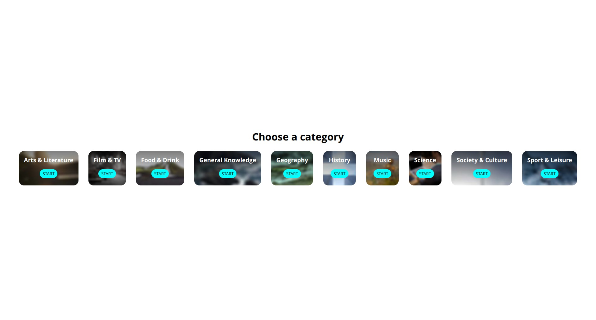

# Quizy

## About
This is a POC to work with the [Trivia API](https://the-trivia-api.com/) and Vue 3 Composition API.

See the [LIVE DEMO](https://jagfx.github.io/quizy/) !

## Goal

This application are split in two folder:

- `Application`: All files specific to the framework / library 
- `Domain`: All files who made our business 

The idea is all files who are placed into the `Domain` folder can be copied and pasted into another application WITHOUT ANY CHANGES.

The `Domain` folder must run in typescript project, another Vue project or React project for example.

The `Application` folder is for the rest (component, composable, style and more...).

## Features

- List all Trivia categories
- Start a quiz from a specific category
- Answer a list of question about this category
- Have a final result about de the quiz (score point and elapsed time)